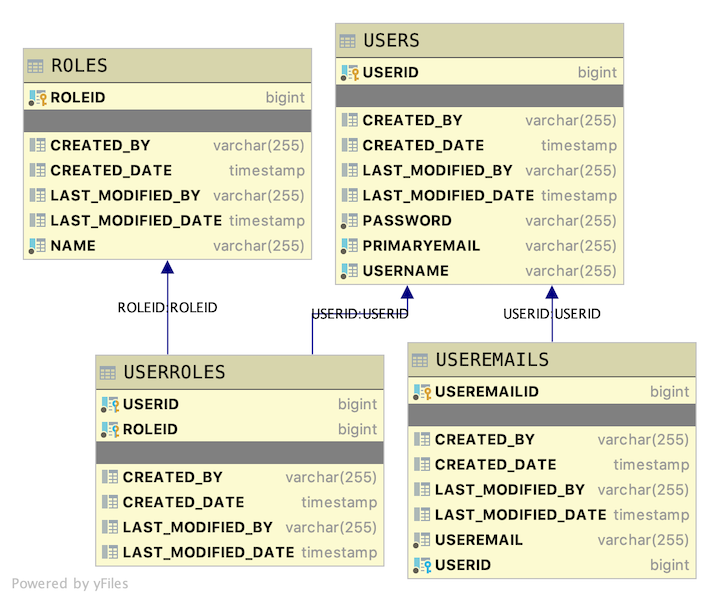

# Java User Model Final Version / Exceptions Final Application / Security Initial Application

## Introduction

This is a basic database scheme with users, user emails, and user roles. This Java Spring REST API application will provide endpoints for clients to read various data sets contained in the application's data. This application will also form the basis of a user authentication application developed elsewhere in the course

### DS API

We worked with the DS team to get city metric data. You can veiw thier docs here. https://ds-c.citrics.dev/#/default
As of right now you can only search by city id. 

#### Database layout

The table layout is similar to the initial version with the following exceptions:

* The join table userroles is explicitly created. This allows us to add additional columns to the join table
* Since we are creating the join table ourselves, the Many to Many relationship that formed the join table is now two Many to One relationships
* All tables now have audit fields

Thus the new table layout is as follows

* User is the driving table.
* Useremails have a Many-To-One relationship with User. Each User has many user email combinations. Each user email combination has only one User.
* Roles have a Many-To-Many relationship with Users.




Using the provided seed data, expand each endpoint below to see the output it generates.

<details>
<summary>http://localhost:2019/useremails/useremails</summary>

```JSON
[
    {
        "useremailid": 5,
        "useremail": "admin@email.local",
        "user": {
            "userid": 4,
            "username": "admin",
            "primaryemail": "admin@lambdaschool.local",
            "roles": [
                {
                    "role": {
                        "roleid": 3,
                        "name": "DATA"
                    }
                },
                {
                    "role": {
                        "roleid": 1,
                        "name": "ADMIN"
                    }
                },
                {
                    "role": {
                        "roleid": 2,
                        "name": "USER"
                    }
                }
            ]
        }
    },
    {
        "useremailid": 6,
        "useremail": "admin@mymail.local",
        "user": {
            "userid": 4,
            "username": "admin",
            "primaryemail": "admin@lambdaschool.local",
            "roles": [
                {
                    "role": {
                        "roleid": 3,
                        "name": "DATA"
                    }
                },
                {
                    "role": {
                        "roleid": 1,
                        "name": "ADMIN"
                    }
                },
                {
                    "role": {
                        "roleid": 2,
                        "name": "USER"
                    }
                }
            ]
        }
    },
    {
        "useremailid": 8,
        "useremail": "cinnamon@mymail.local",
        "user": {
            "userid": 7,
            "username": "cinnamon",
            "primaryemail": "cinnamon@lambdaschool.local",
            "roles": [
                {
                    "role": {
                        "roleid": 2,
                        "name": "USER"
                    }
                },
                {
                    "role": {
                        "roleid": 3,
                        "name": "DATA"
                    }
                }
            ]
        }
    },
    {
        "useremailid": 9,
        "useremail": "hops@mymail.local",
        "user": {
            "userid": 7,
            "username": "cinnamon",
            "primaryemail": "cinnamon@lambdaschool.local",
            "roles": [
                {
                    "role": {
                        "roleid": 2,
                        "name": "USER"
                    }
                },
                {
                    "role": {
                        "roleid": 3,
                        "name": "DATA"
                    }
                }
            ]
        }
    },
    {
        "useremailid": 10,
        "useremail": "bunny@email.local",
        "user": {
            "userid": 7,
            "username": "cinnamon",
            "primaryemail": "cinnamon@lambdaschool.local",
            "roles": [
                {
                    "role": {
                        "roleid": 2,
                        "name": "USER"
                    }
                },
                {
                    "role": {
                        "roleid": 3,
                        "name": "DATA"
                    }
                }
            ]
        }
    },
    {
        "useremailid": 12,
        "useremail": "barnbarn@email.local",
        "user": {
            "userid": 11,
            "username": "barnbarn",
            "primaryemail": "barnbarn@lambdaschool.local",
            "roles": [
                {
                    "role": {
                        "roleid": 2,
                        "name": "USER"
                    }
                }
            ]
        }
    }
]
```

</details>

<details>
<summary>http://localhost:2019/useremails/useremail/8</summary>

```JSON
{
    "useremailid": 8,
    "useremail": "cinnamon@mymail.local",
    "user": {
        "userid": 7,
        "username": "cinnamon",
        "primaryemail": "cinnamon@lambdaschool.local",
        "roles": [
            {
                "role": {
                    "roleid": 2,
                    "name": "USER"
                }
            },
            {
                "role": {
                    "roleid": 3,
                    "name": "DATA"
                }
            }
        ]
    }
}
```

</details>

<details>
<summary>DELETE http://localhost:2019/useremails/useremail/8</summary>

```TEXT
No Body Data

Status OK
```

</details>


<details>
<summary>PUT http://localhost:2019/useremails/useremail/9/email/favbun@hops.local</summary>

OUTPUT

```TEXT
Status OK
```

</details>

<details>
<summary>http://localhost:2019/useremails/useremail/9</summary>

```JSON
{
    "useremailid": 9,
    "useremail": "favbun@hops.local",
    "user": {
        "userid": 7,
        "username": "cinnamon",
        "primaryemail": "cinnamon@lambdaschool.local",
        "roles": [
            {
                "role": {
                    "roleid": 2,
                    "name": "USER"
                }
            },
            {
                "role": {
                    "roleid": 3,
                    "name": "DATA"
                }
            }
        ]
    }
}
```

</details>

<details>
<summary>POST http://localhost:2019/useremails/user/14/email/favbun@hops.local</summary>

OUTPUT

```TEXT
Status CREATED

Location Header: http://localhost:2019/useremails/useremail/15
```

</details>

<details>
<summary>http://localhost:2019/useremails/useremail/15</summary>

```JSON
{
    "useremailid": 15,
    "useremail": "favbun@hops.local",
    "user": {
        "userid": 14,
        "username": "misskitty",
        "primaryemail": "misskitty@school.lambda",
        "roles": [
            {
                "role": {
                    "roleid": 2,
                    "name": "USER"
                }
            }
        ]
    }
}
```

</details>

---

<details>
<summary>http://localhost:2019/roles/roles</summary>

```JSON
[
    {
        "roleid": 1,
        "name": "ADMIN",
        "users": [
            {
                "user": {
                    "userid": 4,
                    "username": "admin",
                    "primaryemail": "admin@lambdaschool.local",
                    "useremails": [
                        {
                            "useremailid": 5,
                            "useremail": "admin@email.local"
                        },
                        {
                            "useremailid": 6,
                            "useremail": "admin@mymail.local"
                        }
                    ]
                }
            }
        ]
    },
    {
        "roleid": 2,
        "name": "USER",
        "users": [
            {
                "user": {
                    "userid": 14,
                    "username": "misskitty",
                    "primaryemail": "misskitty@school.lambda",
                    "useremails": [
                        {
                            "useremailid": 15,
                            "useremail": "favbun@hops.local"
                        }
                    ]
                }
            },
            {
                "user": {
                    "userid": 13,
                    "username": "puttat",
                    "primaryemail": "puttat@school.lambda",
                    "useremails": []
                }
            },
            {
                "user": {
                    "userid": 11,
                    "username": "barnbarn",
                    "primaryemail": "barnbarn@lambdaschool.local",
                    "useremails": [
                        {
                            "useremailid": 12,
                            "useremail": "barnbarn@email.local"
                        }
                    ]
                }
            },
            {
                "user": {
                    "userid": 7,
                    "username": "cinnamon",
                    "primaryemail": "cinnamon@lambdaschool.local",
                    "useremails": [
                        {
                            "useremailid": 9,
                            "useremail": "favbun@hops.local"
                        },
                        {
                            "useremailid": 10,
                            "useremail": "bunny@email.local"
                        }
                    ]
                }
            },
            {
                "user": {
                    "userid": 4,
                    "username": "admin",
                    "primaryemail": "admin@lambdaschool.local",
                    "useremails": [
                        {
                            "useremailid": 5,
                            "useremail": "admin@email.local"
                        },
                        {
                            "useremailid": 6,
                            "useremail": "admin@mymail.local"
                        }
                    ]
                }
            }
        ]
    },
    {
        "roleid": 3,
        "name": "DATA",
        "users": [
            {
                "user": {
                    "userid": 4,
                    "username": "admin",
                    "primaryemail": "admin@lambdaschool.local",
                    "useremails": [
                        {
                            "useremailid": 5,
                            "useremail": "admin@email.local"
                        },
                        {
                            "useremailid": 6,
                            "useremail": "admin@mymail.local"
                        }
                    ]
                }
            },
            {
                "user": {
                    "userid": 7,
                    "username": "cinnamon",
                    "primaryemail": "cinnamon@lambdaschool.local",
                    "useremails": [
                        {
                            "useremailid": 9,
                            "useremail": "favbun@hops.local"
                        },
                        {
                            "useremailid": 10,
                            "useremail": "bunny@email.local"
                        }
                    ]
                }
            }
        ]
    }
]
```

</details>

<details>
<summary>http://localhost:2019/roles/role/3</summary>

```JSON
{
    "roleid": 3,
    "name": "DATA",
    "users": [
        {
            "user": {
                "userid": 4,
                "username": "admin",
                "primaryemail": "admin@lambdaschool.local",
                "useremails": [
                    {
                        "useremailid": 5,
                        "useremail": "admin@email.local"
                    },
                    {
                        "useremailid": 6,
                        "useremail": "admin@mymail.local"
                    }
                ]
            }
        },
        {
            "user": {
                "userid": 7,
                "username": "cinnamon",
                "primaryemail": "cinnamon@lambdaschool.local",
                "useremails": [
                    {
                        "useremailid": 9,
                        "useremail": "favbun@hops.local"
                    },
                    {
                        "useremailid": 10,
                        "useremail": "bunny@email.local"
                    }
                ]
            }
        }
    ]
}
```

</details>

<details>
<summary>http://localhost:2019/roles/role/name/data</summary>

```JSON
{
    "roleid": 3,
    "name": "DATA",
    "users": [
        {
            "user": {
                "userid": 4,
                "username": "admin",
                "primaryemail": "admin@lambdaschool.local",
                "useremails": [
                    {
                        "useremailid": 5,
                        "useremail": "admin@email.local"
                    },
                    {
                        "useremailid": 6,
                        "useremail": "admin@mymail.local"
                    }
                ]
            }
        },
        {
            "user": {
                "userid": 7,
                "username": "cinnamon",
                "primaryemail": "cinnamon@lambdaschool.local",
                "useremails": [
                    {
                        "useremailid": 9,
                        "useremail": "favbun@hops.local"
                    },
                    {
                        "useremailid": 10,
                        "useremail": "bunny@email.local"
                    }
                ]
            }
        }
    ]
}
```

</details>

<details>
<summary>POST http://localhost:2019/roles/role</summary>

DATA

```JSON
{
    "name" : "ANewRole"
}
```

OUTPUT

```TEXT
Status CREATED

Location Header: http://localhost:2019/roles/role/16
```

</details>

<details>
<summary>http://localhost:2019/roles/role/name/anewrole</summary>

```JSON
{
    "roleid": 16,
    "name": "ANEWROLE",
    "users": []
}
```

</details>

<details>
<summary>PUT http://localhost:2019/roles/role/16</summary>

DATA

```JSON
{
    "name" : "ANewRole"
}
```

OUTPUT

```TEXT
Status OK
```

</details>

---

<details>
<summary>http://localhost:2019/users/users</summary>

```JSON
[
    {
        "userid": 4,
        "username": "admin",
        "primaryemail": "admin@lambdaschool.local",
        "useremails": [
            {
                "useremailid": 5,
                "useremail": "admin@email.local"
            },
            {
                "useremailid": 6,
                "useremail": "admin@mymail.local"
            }
        ],
        "roles": [
            {
                "role": {
                    "roleid": 3,
                    "name": "DATA"
                }
            },
            {
                "role": {
                    "roleid": 1,
                    "name": "ADMIN"
                }
            },
            {
                "role": {
                    "roleid": 2,
                    "name": "USER"
                }
            }
        ]
    },
    {
        "userid": 7,
        "username": "cinnamon",
        "primaryemail": "cinnamon@lambdaschool.local",
        "useremails": [
            {
                "useremailid": 9,
                "useremail": "favbun@hops.local"
            },
            {
                "useremailid": 10,
                "useremail": "bunny@email.local"
            }
        ],
        "roles": [
            {
                "role": {
                    "roleid": 2,
                    "name": "USER"
                }
            },
            {
                "role": {
                    "roleid": 3,
                    "name": "DATA"
                }
            }
        ]
    },
    {
        "userid": 11,
        "username": "barnbarn",
        "primaryemail": "barnbarn@lambdaschool.local",
        "useremails": [
            {
                "useremailid": 12,
                "useremail": "barnbarn@email.local"
            }
        ],
        "roles": [
            {
                "role": {
                    "roleid": 2,
                    "name": "USER"
                }
            }
        ]
    },
    {
        "userid": 13,
        "username": "puttat",
        "primaryemail": "puttat@school.lambda",
        "useremails": [],
        "roles": [
            {
                "role": {
                    "roleid": 2,
                    "name": "USER"
                }
            }
        ]
    },
    {
        "userid": 14,
        "username": "misskitty",
        "primaryemail": "misskitty@school.lambda",
        "useremails": [
            {
                "useremailid": 15,
                "useremail": "favbun@hops.local"
            }
        ],
        "roles": [
            {
                "role": {
                    "roleid": 2,
                    "name": "USER"
                }
            }
        ]
    }
]
```

</details>

<details>
<summary>http://localhost:2019/users/user/7</summary>

```JSON
{
    "userid": 7,
    "username": "cinnamon",
    "primaryemail": "cinnamon@lambdaschool.local",
    "useremails": [
        {
            "useremailid": 9,
            "useremail": "favbun@hops.local"
        },
        {
            "useremailid": 10,
            "useremail": "bunny@email.local"
        }
    ],
    "roles": [
        {
            "role": {
                "roleid": 2,
                "name": "USER"
            }
        },
        {
            "role": {
                "roleid": 3,
                "name": "DATA"
            }
        }
    ]
}
```

</details>

<details>
<summary>http://localhost:2019/users/user/name/cinnamon</summary>

```JSON
{
    "userid": 7,
    "username": "cinnamon",
    "primaryemail": "cinnamon@lambdaschool.local",
    "useremails": [
        {
            "useremailid": 9,
            "useremail": "favbun@hops.local"
        },
        {
            "useremailid": 10,
            "useremail": "bunny@email.local"
        }
    ],
    "roles": [
        {
            "role": {
                "roleid": 2,
                "name": "USER"
            }
        },
        {
            "role": {
                "roleid": 3,
                "name": "DATA"
            }
        }
    ]
}
```

</details>

<details>
<summary>http://localhost:2019/users/user/name/like/da</summary>

```JSON
[]
```

</details>

<details>
<summary>POST http://localhost:2019/users/user</summary>

DATA

```JSON
{
    "username": "Mojo",
    "primaryemail": "mojo@lambdaschool.local",
    "password" : "Coffee123",
    "useremails": [
        {
            "useremail": "mojo@mymail.local"
        },
        {
            "useremail": "mojo@email.local"
        }
        ],
    "roles": [
        {
            "role": {
                "roleid": 1
            }
        },
        {
            "role": {
                "roleid": 2
            }
        }
    ]
}
```

OUTPUT

```TEXT
No Body Data

Location Header: http://localhost:2019/users/user/17
Status 201 Created
```

</details>

<details>
<summary>http://localhost:2019/users/user/name/mojo</summary>

</details>

<details>
<summary>PUT http://localhost:2019/users/user/14</summary>

DATA

```JSON
{
    "username": "stumps",
    "primaryemail": "stumps@lambdaschool.local",
    "password" : "EarlGray123",
    "useremails": [
        {
            "useremail": "stumps@mymail.local"
        },
        {
            "useremail": "stumps@email.local"
        }
        ],
    "roles": [
        {  
            "role": {
                "roleid": 3
            }
        },
        {  
            "role": {
                "roleid": 1
            }
        }
    ]
}
```

OUTPUT

```TEXT
No Body Data

Status OK
```

</details>

<details>
<summary>http://localhost:2019/users/user/name/stumps</summary>

```JSON
{
    "userid": 16,
    "username": "stumps",
    "primaryemail": "stumps@lambdaschool.local",
    "useremails": [
        {
            "useremailid": 19,
            "useremail": "stumps@mymail.local"
        },
        {
            "useremailid": 20,
            "useremail": "stumps@email.local"
        }
    ],
    "roles": [
        {
            "role": {
                "roleid": 1,
                "name": "ADMIN"
            }
        },
        {
            "role": {
                "roleid": 3,
                "name": "DATA"
            }
        }
    ]
}
```

</details>

<details>
<summary>PATCH http://localhost:2019/users/user/7</summary>

DATA

```JSON
{
    "username": "cinabun",
    "primaryemail": "cinabun@lambdaschool.home",
    "useremails": [
    {
            "useremail": "cinnamon@mymail.home"
    },
    {
            "useremail": "hops@mymail.home"
    },
    {
            "useremail": "bunny@email.home"
    }
    ]
}
```

OUTPUT

```TEXT
No Body Data

Status OK
```

</details>

<details>
<summary>http://localhost:2019/users/user/name/cinabun</summary>

</details>

```JSON
{
    "userid": 7,
    "username": "cinabun",
    "primaryemail": "cinabun@lambdaschool.home",
    "useremails": [
        {
            "useremailid": 21,
            "useremail": "cinnamon@mymail.home"
        },
        {
            "useremailid": 22,
            "useremail": "hops@mymail.home"
        },
        {
            "useremailid": 23,
            "useremail": "bunny@email.home"
        }
    ],
    "roles": [
        {
            "role": {
                "roleid": 2,
                "name": "USER"
            }
        },
        {
            "role": {
                "roleid": 3,
                "name": "DATA"
            }
        }
    ]
}
```

<details>

<summary>DELETE http://localhost:2019/users/user/14</summary>

```TEXT
No Body Data

Status OK
```

</details>

<details>
<summary>GET_BY_ID http://localhost:2019/cities/city/id/7<summary/>
    
    ```JSON
    {
        "city_id": 7.0,
        "city": "Oro Valley",
        "statename": "Arizona",
        "abbrev": "AZ",
        "ziplist": "85704 85737 85742 85755",
        "timezone": "UTC-7 Mountain",
        "counties": "Pima",
        "latitude": 32.3909071,
        "longitude": -110.96648799999998,
        "FIPS": "04-5160",
        "GNIS": "3745",
        "wiki_img_url": "https://upload.wikimedia.org/wikipedia/commons/thumb/b/ba/Pusch_Ridge_from_Oro_Valley.jpg/580px-Pusch_Ridge_from_Oro_Valley.jpg",
        "website": "www.orovalleyaz.gov ",
        "pop": 44350.0,
        "density_mi_sq": 1320.3,
        "density_km_sq": 509.77,
        "pop_hist": {
            "city": "Oro Valley, Arizona",
            "POP_2010_census": 41011,
            "POP_2011_est": 41250.0,
            "POP_2012_est": 41365.0,
            "POP_2013_est": 41609.0,
            "POP_2014_est": 41894.0,
            "POP_2015_est": 43420.0,
            "POP_2016_est": 43782.0,
            "POP_2017_est": 44543.0,
            "POP_2018_est": 45315.0,
            "POP_2019_est": 46044.0
        },
        "age": 52.4,
        "household": 85392.0,
        "individual": 45092.0,
        "income_hist": {
            "2010_Med_Hou_Inc": "46789",
            "2010_Med_Ind_Inc": "31424",
            "2011_Med_Hou_Inc": "46709",
            "2011_Med_Ind_Inc": "30542",
            "2012_Med_Hou_Inc": "47826",
            "2012_Med_Ind_Inc": "31605",
            "2013_Med_Hou_Inc": "48510",
            "2013_Med_Ind_Inc": "31504",
            "2014_Med_Hou_Inc": "50068",
            "2014_Med_Ind_Inc": "31889",
            "2015_Med_Hou_Inc": "51492",
            "2015_Med_Ind_Inc": "33452",
            "2016_Med_Hou_Inc": "53558",
            "2016_Med_Ind_Inc": "34776",
            "2017_Med_Hou_Inc": "56581",
            "2017_Med_Ind_Inc": "36607",
            "2018_Med_Hou_Inc": "59246",
            "2018_Med_Ind_Inc": "38032",
            "2019_Med_Hou_Inc": "62055",
            "2019_Med_Ind_Inc": "40198"
        },
        "house": 311829.0,
        "home_hist": {
            "2010_01_31": 277528.0,
            "2010_02_28": 275354.0,
            "2010_03_31": 274738.0,
            "2010_04_30": 275918.0,
            "2010_05_31": 275764.0,
            "2010_06_30": 274504.0,
            "2010_07_31": 272783.0,
            "2010_08_31": 271958.0,
            "2010_09_30": 270166.0,
            "2010_10_31": 267372.0,
            "2010_11_30": 263729.0,
            "2010_12_31": 261754.0,
            "2011_01_31": 261572.0,
            "2011_02_28": 259698.0,
            "2011_03_31": 256397.0,
            "2011_04_30": 252009.0,
            "2011_05_31": 249747.0,
            "2011_06_30": 247327.0,
            "2011_07_31": 244426.0,
            "2011_08_31": 241569.0,
            "2011_09_30": 239505.0,
            "2011_10_31": 238581.0,
            "2011_11_30": 237982.0,
            "2011_12_31": 236929.0,

        },
        "rent": 1139.0,
        "COLI": 91.3,
        "ACA_status": "Adopted",
        "jhcovid": {
            "Combined_Key": "Pima, Arizona, US",
            "2020_01_22": 0,
            "2020_01_23": 0,
            "2020_01_24": 0,
            "2020_01_25": 0,
            "2020_01_26": 0,
            "2020_01_27": 0,
            "2020_01_28": 0,
            "2020_01_29": 0,
            "2020_01_30": 0,
            "2020_01_31": 0,
            "2020_02_01": 0,
            "2020_02_02": 0,
            "2020_02_03": 0,
            "2020_02_04": 0,
            "2020_02_05": 0,
            "2020_02_06": 0,
            "2020_02_07": 0,
            "2020_02_08": 0,
            "2020_02_09": 0,
            "2020_02_10": 0,
            "2020_02_11": 0,
            "2020_02_12": 0,
            "2020_02_13": 0,
            "2020_02_14": 0,
            "2020_02_15": 0,
            "2020_02_16": 0,
            "2020_02_17": 0,
            "2020_02_18": 0,
            "2020_02_19": 0,
            "2020_02_20": 0,
            "2020_02_21": 0,
        },
        "weather_hist": {
            "Jan_precip": 1.41,
            "Jan_temp": 50.0,
            "Feb_precip": 3.74,
            "Feb_temp": 48.7,
            "Mar_precip": 0.86,
            "Mar_temp": 58.9,
            "Apr_precip": 0.07,
            "Apr_temp": 67.0,
            "May_precip": 0.19,
            "May_temp": 68.0,
            "Jun_precip": 0.01,
            "Jun_temp": 83.3,
            "Jul_precip": 1.13,
            "Jul_temp": 87.5,
            "Aug_precip": 1.12,
            "Aug_temp": 87.0,
            "Sep_precip": 1.57,
            "Sep_temp": 80.4,
            "Oct_precip": 0.0,
            "Oct_temp": 70.2,
            "Nov_precip": 3.01,
            "Nov_temp": 62.6,
            "Dec_precip": 2.4,
            "Dec_temp": 50.3
        }
    }
</details>
